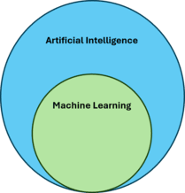

# What is Machine Learning?

The term *Machine Learning* was popularized by Arthur Samuel in 1959 in a seminal paper where he explained that computers could be programmed to beat their programmer in the checkers game. However, some studies have previously been performed in the field of artificial intelligence and neural networks, thanks to the works of Walter Pitts, Warren McCulloch, Donald Hebb, Alan Turing, Marvin Minsky, and Dean Edmonds.

There is actually no formal or official definition of the term, therefore, we could define *Machine Learning* as follows:

> Machine learning (ML) is a field of study in artificial intelligence concerned with the development and study of statistical algorithms that can learn from data and generalize to unseen data, and thus perform tasks without explicit instructions.[1]
> (Wikipedia)

> El aprendizaje automático (AA); también llamado automatizado, computacional, de máquinas, o maquinal1​ (del inglés machine learning, ML), es el subcampo de las ciencias de la computación y una rama de la inteligencia artificial, cuyo objetivo es desarrollar técnicas que permitan que las computadoras aprendan.

[^1]: The definition "without being explicitly programmed" is often attributed to Arthur Samuel, who coined the term "machine learning" in 1959, but the phrase is not found verbatim in this publication, and may be a paraphrase that appeared later. Confer "Paraphrasing Arthur Samuel (1959), the question is: How can computers learn to solve problems without being explicitly programmed?" in Koza, John R.; Bennett, Forrest H.; Andre, David; Keane, Martin A. (1996). "Automated Design of Both the Topology and Sizing of Analog Electrical Circuits Using Genetic Programming". Artificial Intelligence in Design '96. Artificial Intelligence in Design '96. Dordrecht, Netherlands: Springer Netherlands. pp. 151–170. doi:10.1007/978-94-009-0279-4_9. ISBN 978-94-010-6610-5.